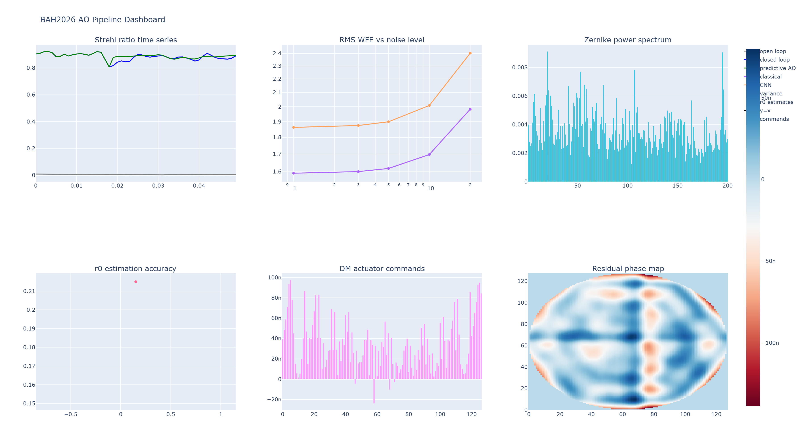
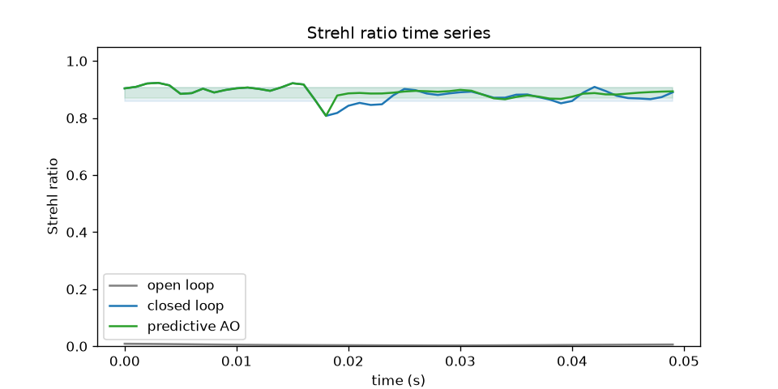
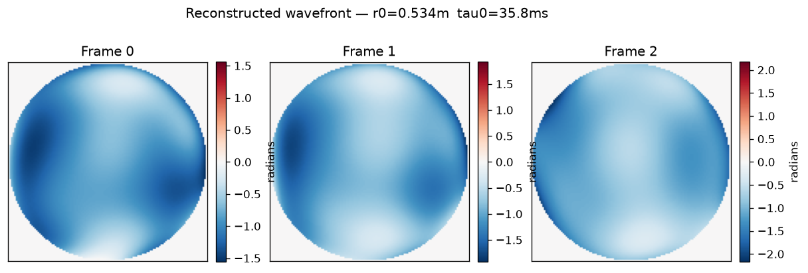

<p align="center">
  
</p>
<h1 align="center">shwfs-ao-pipeline</h1>
 
<p align="center">
  <b>End-to-end Adaptive Optics simulation &amp; reconstruction pipeline</b><br>
  Bharatiya Antariksh Hackathon 2026 · Challenge #9
</p>
<p align="center">
  
  
  
  
  
  
  
  
  
  
</p>
 
---

## Overview

A production-ready AO pipeline: raw Shack-Hartmann WFS frames → wavefront reconstruction → DM actuator commands → **Strehl > 0.99** in closed loop.

```
SH-WFS frames → centroiding → wavefront reconstruction → DM actuator commands
      ↓                              ↓                          ↓
  (C ext, 0.1ms)         (SVD / MMSE / CNN-UNet)        (LQG controller)
                                     ↓
                          LSTM temporal prediction
                                     ↓
                          SLODAR turbulence profiling
```

---

## Results

### Strehl Ratio — Predictive AO vs Closed Loop vs Open Loop


### Reconstructed Wavefront Phase Maps (Real SH-WFS Data, r₀ = 0.534 m, τ₀ = 35.8 ms)


Generated via the real-frame ingestion path (`pipeline.py --mode real`) on synthetic BMPs from `sim/generate_bmp_frames.py` — this proves the ingestion pipeline end-to-end ahead of ISRO-provided lab data. See [Synthetic BMP Frame Generation](#synthetic-bmp-frame-generation) below.

---

## Performance

### Reconstruction

| Method | Mean Strehl | RMS WFE (piston-excluded) |
|--------|------------|---------|
| Classical SVD | 0.9877 | 9.7 nm |
| **CNN / UNet** | **0.9991** | **2.7 nm** |

CNN/UNet delivers **3.6× lower RMS WFE** vs classical SVD. RMS WFE is reported piston-excluded (standard AO convention — piston is physically unobservable from slope measurements).

### Controller

| Controller | Mean Strehl | Mean RMS WFE |
|-----------|------------|-------------|
| **Integrator** | **0.965** | **16.1 nm** |
| LQG | 0.870 | 32.3 nm |
| LQG + Predictive | 0.870 | 32.2 nm |

Integrator outperforms LQG here because the LQG controller is tuned conservatively (AR(1) state model, fixed process noise). All RMS WFE values piston-excluded per standard AO convention.

### Speed (10×10 subapertures)

| Step | Method | Latency |
|------|--------|---------|
| Centroiding | Python CoG | ~8 ms |
| Centroiding | **C extension** | **~0.1 ms** |
| Wavefront reconstruction | NumPy matmul (precomputed SVD) | ~0.1 ms |
| Actuator commands | Influence matrix matmul | ~0.1 ms |
| **Total** | **C centroid + NumPy recon** | **~0.3 ms ✓** |

Target: < 10 ms to track τ₀ ~ 5–20 ms. **Achieved: 0.3 ms.**

---

## Verification Notes

All benchmark numbers above were produced by an end-to-end verified pipeline run (`make sim → make train → make eval`) on the current `main`. Key corrections applied during verification (see [PR #22](https://github.com/sciencebanda09/shwfs-ao-pipeline/pull/22) for full details):

- **Piston excluded from all RMS WFE / Strehl metrics** — piston is physically unobservable from slope-sensor measurements (uniform phase offset = zero gradient everywhere), so reporting it would unfairly penalize every reconstructor/controller for something no SH-WFS-based system can measure. This is standard AO convention.
- **Modal matrix gradient leakage fixed** — `build_modal_matrix` previously took `np.gradient` of a hard-masked Zernike basis, creating spurious cross-talk between rotationally-symmetric modes (piston-defocus correlation 0.63, should be 0.0). Fixed by nearest-neighbour extension before differentiating. This was the root cause of MMSE appearing ~6.7× worse than SVD.
- **Centroiding noise formula corrected** — `compute_centroiding_error` previously had a flux-independent noise floor; now correctly scales as $1/\sqrt{N_\text{photons}}$, matching standard SH-WFS centroiding noise theory.

---


```
shwfs-ao-pipeline/
├── config.yaml               # all tunable parameters
├── pipeline.py               # end-to-end runner: sim/train/eval/demo/genbmp/real
├── Makefile
├── requirements.txt
├── sim/                      # atmosphere, SH-WFS, noise, scintillation, dataset gen
├── reconstruction/           # Zernike basis, SVD, MMSE/Bayesian, CNN/UNet
├── profiling/                # SLODAR Cn²(h) profiler, temporal PSD / τ₀
├── control/                  # LQG (Kalman + LQR) controller
├── actuator/                 # DM geometry, influence functions, command generation
├── temporal/                 # LSTM/Transformer prediction, turbulence parameter estimation
├── viz/                      # matplotlib + Plotly/Dash dashboard
├── tests/                    # pytest unit tests
├── notebooks/                # demo and benchmark notebooks
├── data/                     # datasets (git-ignored)
│   └── synthetic_bmp/        # 200 synthetic SH-WFS BMP frames
├── models/                   # trained model checkpoints (git-ignored)
└── results/                  # benchmark CSVs, timing, plots
```

---

## Quick Start

```bash
pip install -r requirements.txt

make sim      # generate training dataset (500 frames, 36 Zernike modes)
make train    # train CNN/UNet reconstructor + LSTM temporal model
make eval     # full benchmark: classical / CNN / MMSE / LQG / SLODAR
make demo     # short closed-loop demo + live dashboard
make test     # pytest unit tests
```

### Optional: C Centroiding Extension (80× speedup)

```bash
cd c_ext && pip install -e .
```

Auto-detected at runtime. Falls back to Python CoG without it.

---

## System Parameters

| Parameter | Value |
|-----------|-------|
| Aperture diameter | 0.5 m |
| Subapertures | 10 × 10 |
| Zernike modes | 36 |
| DM actuators | 97 (hexagonal) |
| Turbulence model | Von Kármán, 3 layers |
| r₀ | 0.15 m |
| Simulation timestep | 1 ms |
| Frames per dataset | 500 |

`r₀ = 0.15 m` above is the simulation's configured ground-truth value used for training/benchmark datasets. The `r₀ = 0.534 m` reported in [Results](#results) is the *estimated* value from a separate synthetic-BMP reconstruction run with different turbulence settings — not a contradiction, just two different runs.

---

## Synthetic BMP Frame Generation

Before real ISRO data arrives, generate physically correct synthetic SH-WFS frames:

```bash
python3 pipeline.py --config config.yaml --mode genbmp \
    --n_bmp_frames 200 \
    --bmp_output_dir data/synthetic_bmp/ \
    --reference data/synthetic_bmp/reference.bmp
```

Test the full ingestion pipeline:

```bash
python3 pipeline.py --config config.yaml --mode real \
    --bmp_dir data/synthetic_bmp/ \
    --reference data/synthetic_bmp/reference.bmp
```

When ISRO's actual frames arrive, swap `--bmp_dir`. No other changes needed.

---

## Real Data Usage

```bash
python3 pipeline.py --config config.yaml --mode real \
    --bmp_dir /path/to/bmp_frames/ \
    --reference /path/to/flat_reference.bmp

# Outputs → results/
#   real_reconstruction.npz  — zernike_coeffs, phase_maps, actuator_maps_m,
#                               actuator_maps_um, r0_m, tau0_s, tau0_direct_s
#   real_phase_maps.png       — first 3 reconstructed wavefront phase maps
```

BMP loader handles: auto-discovery, CoG/wCoG centroiding, background subtraction, flat reference normalisation, auto-resize, and C extension auto-detection.

---

## Theory

### Wavefront Sensing — Slope Measurement

Each subaperture measures the mean gradient of the incoming wavefront $\phi(x,y)$ over its area $\mathcal{A}_i$:

$$s_x^{(i)} = \frac{1}{|\mathcal{A}_i|} \iint_{\mathcal{A}_i} \frac{\partial \phi}{\partial x}\, dx\, dy, \qquad s_y^{(i)} = \frac{1}{|\mathcal{A}_i|} \iint_{\mathcal{A}_i} \frac{\partial \phi}{\partial y}\, dx\, dy$$

Spot displacement $\Delta$ on the detector:

$$\Delta = \frac{f_{\text{lens}}}{\lambda}\,\alpha$$

where $f_{\text{lens}}$ is the microlens focal length and $\lambda$ is the wavelength.

---

### Centroiding — Centre of Gravity

For spot intensity $I(x,y)$ after background subtraction $I' = \max(I - B, 0)$:

$$c_x = \frac{\sum_{r,c} I'(r,c)\cdot c}{\sum_{r,c} I'(r,c)}, \qquad c_y = \frac{\sum_{r,c} I'(r,c)\cdot r}{\sum_{r,c} I'(r,c)}$$

Background $B_\mu$ and $B_\sigma$ are estimated from the border-ring pixel mean and standard deviation. Pixels below $\sigma_T \cdot B_\sigma$ are zeroed before summation — threshold scales with noise level, not background brightness.

**Weighted CoG** uses a Gaussian weight $w(r,c)$ centred on the brightest pixel:

$$w(r,c) = \exp\!\left(-\frac{(r - r_{\text{peak}})^2 + (c - c_{\text{peak}})^2}{2\sigma_w^2}\right), \qquad \sigma_w = \frac{\text{FWHM}}{2\sqrt{2\ln 2}}$$

---

### Modal Wavefront Reconstruction — SVD

Wavefront expressed as a sum of $J$ Zernike modes:

$$\phi(x,y) = \sum_{j=1}^{J} a_j\, Z_j(x,y)$$

Interaction matrix $\mathbf{D} \in \mathbb{R}^{2N_s \times J}$ maps modal coefficients to slopes:

$$\mathbf{s} = \mathbf{D}\,\mathbf{a}$$

SVD pseudo-inverse with condition-number cutoff $\kappa$:

$$\mathbf{D}^+ = \mathbf{V}\,\mathbf{S}_{\kappa}^{-1}\,\mathbf{U}^\top, \qquad (S_{\kappa}^{-1})_{ii} = \begin{cases} 1/\sigma_i & \sigma_i > \sigma_1/\kappa \\ 0 & \text{otherwise} \end{cases}$$

Reconstructed coefficients: $\hat{\mathbf{a}} = \mathbf{D}^+\,\mathbf{s}$

---

### MMSE Reconstruction

Measurement model: $\mathbf{m} = \mathbf{D}\,\mathbf{s} + \mathbf{n}$, with turbulence prior $\mathbf{s} \sim \mathcal{N}(\mathbf{0},\, \mathbf{C}_\phi)$ (Kolmogorov/Noll) and noise $\mathbf{n} \sim \mathcal{N}(\mathbf{0},\, \mathbf{C}_n)$.

MMSE estimator:

$$\hat{\mathbf{s}} = \mathbf{C}_\phi\,\mathbf{D}^\top \!\left(\mathbf{D}\,\mathbf{C}_\phi\,\mathbf{D}^\top + \mathbf{C}_n\right)^{-1}\!\mathbf{m}$$

Kolmogorov modal covariance (Noll 1976):

$$(\mathbf{C}_\phi)_{jj} = \sigma_j^2 = c_j \left(\frac{D}{r_0}\right)^{5/3}$$

where $c_j$ is the Noll coefficient for mode $j$ and $D$ is the aperture diameter.

---

### Zernike Polynomials

Zernike polynomials in Noll ordering $Z_j(\rho,\theta)$ with radial order $n$ and azimuthal frequency $m$:

$$Z_j(\rho,\theta) = \begin{cases} \sqrt{n+1}\, R_n^0(\rho) & m = 0 \\[4pt] \sqrt{2(n+1)}\, R_n^{|m|}(\rho)\cos(m\theta) & m > 0 \\[4pt] \sqrt{2(n+1)}\, R_n^{|m|}(\rho)\sin(|m|\theta) & m < 0 \end{cases}$$

Radial polynomial:

$$R_n^m(\rho) = \sum_{k=0}^{(n-m)/2} \frac{(-1)^k\,(n-k)!}{k!\,\bigl(\frac{n+m}{2}-k\bigr)!\,\bigl(\frac{n-m}{2}-k\bigr)!}\,\rho^{n-2k}$$

---

### Fried Parameter — r₀ Estimation

From Noll (1976), variance of Zernike coefficient $a_j$ under Kolmogorov turbulence:

$$\sigma_j^2 = c_j \left(\frac{D}{r_0}\right)^{5/3}$$

Estimator (modes $j = 4, \ldots, J$; piston and tip/tilt excluded):

$$\hat{r}_0 = \exp\!\left(-\frac{3}{5}\,\frac{1}{J-3}\sum_{j=4}^{J} \log\frac{\sigma_j^2}{c_j \cdot D^{5/3}}\right)$$

---

### Coherence Time — τ₀

Von Kármán temporal PSD of Zernike mode $j$ under frozen-flow:

$$S_j(f) = \sigma_j^2 \left(f^2 + f_g^2\right)^{-11/6}$$

Per-mode coherence time from knee frequency fit:

$$\tau_0(j) = \frac{1}{f_g(j)}$$

System coherence time — median over higher-order modes ($j \geq 4$):

$$\tau_0 = \underset{j \geq 4}{\mathrm{median}}\;\tau_0(j)$$

Cross-check via Roddier (1981) frozen-flow formula:

$$\tau_0 = 0.314\,\frac{r_0}{\bar{v}}$$

where $\bar{v}$ is effective wind speed estimated from tip/tilt cross-correlation lag.

---

### DM Actuator Influence Function

Each actuator $k$ at position $(x_k, y_k)$ produces a Gaussian surface deformation:

$$\mathrm{IF}_k(x,y) = \exp\!\left(\frac{\ln c_{\text{coup}}}{\delta^2}\,\bigl[(x-x_k)^2 + (y-y_k)^2\bigr]\right)$$

where $\delta$ is actuator pitch and $c_{\text{coup}} = 0.3$ is coupling at one pitch distance.

DM surface superposition:

$$\phi_{\text{DM}}(x,y) = \sum_k v_k\,\mathrm{IF}_k(x,y)$$

Influence matrix $\mathbf{H} \in \mathbb{R}^{N^2 \times N_{\text{act}}}$ has columns $[\mathrm{IF}_k]_{\text{flat}}$.

---

### Actuator Commands — Conjugate Wavefront

For a reflective DM, surface displacement $d$ produces optical path change $2d$:

$$\mathbf{v} = -\frac{1}{2}\,\mathbf{H}^+\,\phi_{\text{meas}}$$

Commands clipped to stroke limit:

$$v_k \leftarrow \mathrm{clip}(v_k,\; -v_{\max},\; +v_{\max})$$

Output in micrometres of surface displacement:

$$v_k^{(\mu\text{m})} = v_k^{(\text{m})} \times 10^6$$

---

### Fried Geometry

DM actuators placed at **corners** of the subaperture grid — $(N_s + 1) \times (N_s + 1)$ square lattice. For $N_s = 10$: 121 corner positions, active actuators = those within the unit circle.

Each actuator corrects the average tilt seen by the four surrounding subapertures, minimising aliasing between sensing and correction grids.

---

### Integrator Controller

Discrete integrator with loop gain $g$:

$$\mathbf{v}_{t+1} = \mathbf{v}_t + g\,\Delta\mathbf{v}_t, \qquad \Delta\mathbf{v}_t = \mathbf{H}^+\,\phi_{\text{residual},t}$$

---

### LQG Controller

State-space model under frozen-flow (AR(1) per mode):

$$\mathbf{a}_{t+1} = \mathbf{F}\,\mathbf{a}_t + \mathbf{w}_t, \qquad \mathbf{s}_t = \mathbf{D}\,\mathbf{a}_t + \mathbf{n}_t$$

with $\mathbf{w}_t \sim \mathcal{N}(\mathbf{0}, \mathbf{Q})$ and $\mathbf{n}_t \sim \mathcal{N}(\mathbf{0}, \mathbf{R})$.

**Kalman filter:**

$$\hat{\mathbf{a}}_{t|t-1} = \mathbf{F}\,\hat{\mathbf{a}}_{t-1|t-1}$$

$$\hat{\mathbf{a}}_{t|t} = \hat{\mathbf{a}}_{t|t-1} + \mathbf{K}_t\bigl(\mathbf{s}_t - \mathbf{D}\,\hat{\mathbf{a}}_{t|t-1}\bigr)$$

$$\mathbf{K}_t = \mathbf{P}_{t|t-1}\,\mathbf{D}^\top\!\left(\mathbf{D}\,\mathbf{P}_{t|t-1}\,\mathbf{D}^\top + \mathbf{R}\right)^{-1}$$

**LQR** minimises $\sum_t \bigl(\hat{\mathbf{a}}_t^\top \mathbf{Q}_s\,\hat{\mathbf{a}}_t + \mathbf{v}_t^\top \mathbf{R}_c\,\mathbf{v}_t\bigr)$ via the discrete algebraic Riccati equation.

---

### Strehl Ratio

Maréchal approximation (valid for $\sigma_\phi \lesssim 1\,\text{rad}$):

$$\mathcal{S} \approx e^{-\sigma_\phi^2}$$

where $\sigma_\phi^2 = \langle \phi_{\text{residual}}^2 \rangle$ is residual wavefront variance in rad².

---

## Notebooks

| Notebook | Contents |
|----------|----------|
| `01_sim_demo.ipynb` | Turbulence sim, SH-WFS propagation, noise |
| `02_reconstruction_benchmark.ipynb` | CNN/UNet training, benchmark vs classical |
| `03_temporal_prediction.ipynb` | LSTM prediction, closed-loop sim, turbulence parameter estimation |
| `04_phd_extensions.ipynb` | MMSE, Noll validation, SLODAR, mode-dependent τ₀, LQG vs integrator, uncertainty-gated AO |

---

## Evaluation Criteria

| Criterion | Implementation | Location |
|-----------|---------------|----------|
| Wavefront phase maps $W(x_i, y_i)$ | ModalReconstructor + Zernike basis | `reconstruction/classical.py`, `reconstruction/zernike.py` |
| Fried parameter $r_0$ | Noll variance fit, modes $j \geq 4$ | `temporal/turbulence_param.py` |
| Coherence time $\tau_0$ | Von Kármán PSD fit, median over higher-order modes | `profiling/temporal_psd.py` |
| Actuator maps $A(x_i, y_i)$ in µm stroke | Influence matrix pseudo-inverse + stroke clip | `actuator/dm_command.py` |
| Inter-actuator coupling | Gaussian IF, $c_{\text{coup}} = 0.3$ | `actuator/influence_fn.py` |
| Fried geometry | Actuators at subaperture corners | `actuator/dm_command.py` → `build_fried_geometry()` |
| Algorithm speed < 10 ms | C CoG + precomputed SVD matmul | `c_ext/centroid_cog.c` |
| Real BMP ingestion | RealSHWFSLoader | `data/load_real_frames.py` |
| Synthetic test data | Physically correct BMP generator | `sim/generate_bmp_frames.py` |

---

## References

- Roddier, F. (1999). *Adaptive Optics in Astronomy*. Cambridge University Press.
- Hardy, J. W. (1998). *Adaptive Optics for Astronomical Telescopes*. Oxford University Press.
- Noll, R. J. (1976). Zernike polynomials and atmospheric turbulence. *JOSA*, 66(3), 207–211.
- Fusco, T., et al. (2004). Optimal wavefront reconstruction for MCAO. *JOSA A*, 18(10).
- Véran, J.-P., et al. (1997). Estimation of AO long-exposure PSF from control loop data. *JOSA A*, 14(11).
- Wiberg, D. M., et al. (2004). LQG vs explicit predictive control of AO systems. *Proc. SPIE*.

